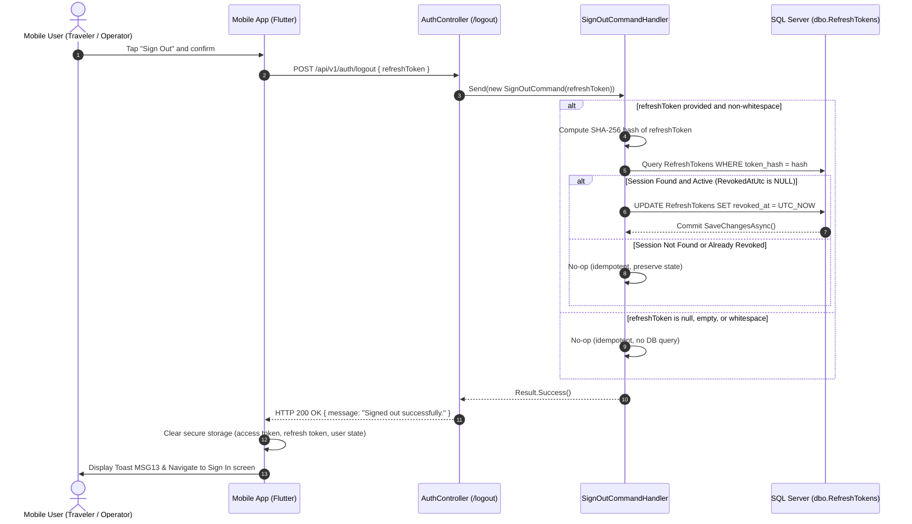

# UC-05 — Sign Out
## Backend Specification (`Capstone_BE`)

> **Document Status: APPROVED FOR PLANNING (Rev. 2.1 — 2026-09-16)**
> Aligned with Software Requirement Specification (SRS Report 3, §2.2 UC-05, §3.2.5 Sign Out, §5.1 BR-12, BR-13, §5.3 MSG13), `TEAM_ENGINEERING_RULES.docx` (v2.0), `Dev_and_CrossReview_Checklist.docx` (v2.0), `AGENTS.md`, and the ratified UC-04 Sign-In Specification/Plan (`specs/UC-04-spec.md`, `plans/UC-04-plan.md` §T23).
> **Scope:** Backend (`Capstone_BE`) only. This document defines the HTTP API contracts, Clean Architecture layering, session revocation mechanics, idempotency rules, test verification suite, and records the approved engineering decision for the stateless JWT authentication model.
> **Notice:** The specification is approved for creation of the UC-05 implementation plan. Implementation must NOT begin until the implementation plan has also been reviewed and approved.

---

## 1. Document Control & Metadata

| Item | Value |
|---|---|
| Use Case ID | **UC-05** |
| Name | **Sign Out** |
| Primary Actors | **Traveler**, **Tour Operator**, **Administrator** |
| Target System | `Capstone_BE` (ASP.NET Core 10 Web API) |
| Consumers | `Capstone_Mobile` (Flutter), `Capstone_FE` (Next.js Web Admin & Public/User Web) |
| Authoritative Sources | SRS Report 3 §2.2 (UC-05), §3.2.5 (Sign Out), §5.1 (BR-12, BR-13), §5.3 (MSG13); `TEAM_ENGINEERING_RULES.docx` (v2.0, §8, §9, §10, §11, §12, §14, §15, §17, §18); `AGENTS.md` (§1.1, §2.1, §2.2, §2.3, §3.1, §3.2, §4); `UC-04-plan.md` §T23 |
| Related Specifications | [`UC-04-spec.md`](UC-04-spec.md) (Sign In & Session Issuance), [`UC-01-spec.md`](UC-01-spec.md) (Registration & Email Verification) |
| Database Schema | `database/tripmate_schema_v7.sql` (`dbo.RefreshTokens`) — **Database-First; NO schema changes or EF migrations required** |
| Approved Architecture | **Stateless JWT Session Architecture** (Current-session refresh token revocation in `dbo.RefreshTokens`, client-side auth state clearing, natural ~15-minute access token expiry drain, zero Redis/cache blacklist infrastructure) |

---

## 2. Business Requirement & Goal

### 2.1 Source Requirement (SRS Report 3 §2.2 & §3.2.5)

**SRS §2.2 (UC-05 Summary — Verbatim):**
> "Allows an authenticated user to terminate the current TripMate session. The application removes or invalidates the relevant authentication information on the client so that protected system functions cannot continue to be accessed using the terminated session. The user must authenticate again to access protected functions."

**SRS §3.2.5 (Function Description Purpose — Verbatim):**
> "Allows an authenticated user to terminate the current session so that the issued tokens can no longer be used to access protected functions."

### 2.2 Derived Backend Design & Operational Boundaries

1. **Current Session Scope:** The operation terminates the **current authenticated session only**. It is strictly a single-session sign-out. Concurrent sessions on other devices or browser contexts remain valid and operational. "Sign Out All Devices" is explicitly out of scope.
2. **Refresh Token Invalidation:** Invalidation is achieved on the server by setting `RevokedAtUtc = dateTimeProvider.UtcNow` on the matching row in `dbo.RefreshTokens`. Once revoked, the refresh token can never be exchanged for a new access token at session restoration endpoints.
3. **Web Cookie Removal:** For Web sessions, the server clears the HttpOnly `tripmate_refresh` cookie (`Max-Age=0`) to ensure browser storage does not retain stale credentials.
4. **Client-Side State Termination:** The client application (Mobile or Web) is responsible for immediately clearing its local in-memory and persistent auth state (access token, cached user profile).
5. **Access Token Semantics & Known Deviation:** The backend follows the existing stateless JWT model. Already-issued access JWTs are not added to a server-side blacklist and remain cryptographically valid until their existing natural expiration (~15 minutes). Client applications clear their local authentication state upon logout, preventing continued legitimate use. Rejection of the access token by protected functions is enforced after natural expiration rather than via per-request server-side blacklist checks. The literal SRS PC-02/BR-12 wording requiring an access-token blacklist is documented as a known deviation for deferred document reconciliation (see §4 and §6.2).

---

## 3. Actors & Preconditions

### 3.1 Actors
- **Traveler:** Authenticated mobile or web user with role `Traveler`.
- **Tour Operator:** Authenticated mobile or web user with role `TourOperator`.
- **Administrator:** Web actor for UC-05 with role `Administrator`. The primary Administrator sign-in contract is `/api/v1/auth/web/admin/login`. Authentication lifecycle behavior outside UC-05 is governed by UC-04 and is not redefined here.

### 3.2 Preconditions
1. The user has previously established a session via password login, Google social sign-in, or email verification.
2. For Mobile: The mobile client holds a raw refresh token issued during authentication.
3. For Web: The browser holds an HttpOnly cookie named `tripmate_refresh` on path `/api/v1/auth`.
4. The database service (`dbo.RefreshTokens`) is reachable.
5. *Note on Access Tokens:* Sign-out endpoints do not require a valid access JWT (`[AllowAnonymous]` at endpoint level). The user's access token **may be active OR already expired**. An expired or absent access token does NOT prevent sign-out, as the refresh credential alone identifies the session to revoke.

---

## 4. Postconditions

- **PC-01 (Refresh Token Revoked — Verbatim SRS §3.2.5):**
  *"The refresh token of the terminated session can no longer be exchanged for a new access token."*
  -> **Satisfied** by stamping `RevokedAtUtc = dateTimeProvider.UtcNow` on `dbo.RefreshTokens`. Any subsequent refresh attempt via `POST /api/v1/auth/web/refresh` fails with HTTP 401 `AUTH_TOKEN_INVALID`.
- **PC-02 (Access Token Rejection — Verbatim SRS §3.2.5):**
  *"The access token of the terminated session is rejected by every protected function until its natural expiry."*
  -> **IMPLEMENTATION DECISION / KNOWN DEVIATION (Status: KNOWN DEVIATION / DEFERRED DOCUMENT RECONCILIATION):**
  The approved engineering decision standardizes on TripMate's existing stateless JWT architecture without server-side access-token blacklisting. The access token is a stateless JWT that remains cryptographically valid until its existing natural expiration (~15 minutes). Client applications immediately clear the access token from local memory/storage upon logout, preventing its continued legitimate use. Once the associated refresh token in `dbo.RefreshTokens` is revoked, no new access token can be obtained. Rejection of the access token by protected functions is enforced through its natural expiration rather than via per-request server-side blacklist checks. The SRS wording requiring server-side blacklisting will be reconciled in a separate document revision.
- **PC-03 (Client State Cleared — Verbatim SRS §3.2.5):**
  *"The client no longer stores session tokens or cached session data."*
  -> **Satisfied.** Handled by client applications upon initiating sign-out; Web browser cookie cleared via `Set-Cookie` response header (`Max-Age=0; Expires=Thu, 01 Jan 1970 00:00:00 GMT`).
- **PC-04 (Security Audit Logging — Verbatim SRS §3.2.5):**
  *"The sign-out event is recorded for security auditing."*
  -> **Satisfied** by sanitized, structured operational logging on the backend.
- **PC-05 (Multi-Session Independence):** Any other active sessions (`dbo.RefreshTokens` rows) belonging to the same user remain unchanged and active.
- **PC-06 (Zero Account State Mutation):** The `User` record (`Role`, `Status`, `LastLoginAtUtc`, `UpdatedAtUtc`, password hash) and `OperatorProfile` record (`ApprovalStatus`) remain completely untouched.

---

## 5. Business Rules & Invariants

- **BR-12 (Server Session Revocation & Blacklist — Verbatim SRS §3.2.5):**
  *"A sign-out invalidates the refresh token of the current session and blacklists the current access token until its natural expiry."*
  -> **IMPLEMENTATION DECISION / KNOWN DEVIATION (Status: KNOWN DEVIATION / DEFERRED DOCUMENT RECONCILIATION):**
  Backend revokes the matching refresh token row in `dbo.RefreshTokens`. Server-side access-token blacklisting is intentionally omitted in accordance with the approved stateless JWT engineering decision. The client clears the access token locally, and the token drains naturally upon expiration. Literal SRS blacklist reconciliation is deferred.
- **BR-13 (Client State Termination — Verbatim SRS §3.2.5):**
  *"The local session data and the stored tokens must always be cleared on the client, even when the server-side invalidation cannot be completed."*
  -> **IMPLEMENTATION DECISION / KNOWN DEVIATION (Status: KNOWN DEVIATION / SUPERSEDED FOR UC-05 WEB FLOW):**
  For the UC-05 **Web** sign-out flow this rule is intentionally NOT followed. The developer-approved Frontend failure policy (Capstone_FE `specs/UC-05-web-spec.md` §14 **D1**, approved 2026-09-17) is **session-preserving**: when the remote logout request fails (network error or non-2xx, including an infrastructure 500), the Web client does NOT clear its local authentication state — it retains the authenticated context and UI, displays the approved safe error, re-enables the logout control and allows retry. Local state is cleared only after a confirmed HTTP 200.
  **Rationale:** a failed sign-out request can leave the server-side refresh session and the HttpOnly `tripmate_refresh` cookie still valid; a local-only clear would then let a subsequent cold restore / remount / F5 silently re-authenticate the user instead of reflecting the real remote session state.
  **Code change required: NO** — this is a client-side policy statement; Backend behavior is unchanged (revoke matching refresh row, clear cookie, idempotent 200, 500 ProblemDetails on infrastructure failure). This deviation is scoped to the UC-05 Web flow and does not redefine the Mobile client contract. Reconciliation of the literal SRS §3.2.5 BR-13 wording is deferred to the same documentation cycle already used for PC-02/BR-12.
- **BR-14 (Zero State Mutation):** Sign-out is an authentication session event, not a user management operation. It must never mutate user status, role, email verification timestamp, last login timestamp, or tour operator approval status.
- **BR-15 (Current Session Granularity):** Sign-out affects only the session presented in the request (identified by the refresh token hash or cookie). It never affects other sessions belonging to the same `UserId`.
- **BR-16 (Authentication Requirement):** Sign-out endpoints must allow unauthenticated or expired access tokens (`[AllowAnonymous]` at endpoint level). The presented refresh credential identifies the refresh session to revoke when a matching session exists. Logout does not require proof that an active refresh session currently exists. A valid access JWT is not required. No access-token parsing or blacklist processing is performed.
- **BR-17 (Idempotency):** Repeated sign-out requests with the same token, an already-revoked token, an unknown token, or a missing cookie must succeed idempotently (returning HTTP 200 with MSG13) without throwing exceptions, without mutating already-set `RevokedAtUtc` timestamps, and without exposing whether a session existed.

---

## 6. Token & Session Architecture & Approved Decision

### 6.1 Session Storage Model (`dbo.RefreshTokens`)

TripMate uses a hybrid stateless access token + stateful refresh session model:
- **Access Token:** Short-lived JWT (~15 minutes lifetime + 1 minute clock skew), HMAC-SHA256 signed. Contains identity and role claims (`sub`, `nameid`, `email`, `role`, `jti`). It is completely stateless; no database or cache blacklist lookup is performed during request authorization. It remains cryptographically valid until its existing natural expiration.
- **Refresh Token (Session):** High-entropy 64-byte random value (Base64 string). Stored exclusively as a SHA-256 hash in `dbo.RefreshTokens.token_hash`.
  - Creation: Login/verify-email adds a row (`UserId`, `TokenHash`, `CreatedAtUtc`, `ExpiresAtUtc = now + 7 days`, `RevokedAtUtc = NULL`).
  - Active Check: `RevokedAtUtc IS NULL && DateTimeOffset.UtcNow < ExpiresAtUtc`.
  - Revocation (UC-05): Setting `RevokedAtUtc = dateTimeProvider.UtcNow`.

### 6.2 Approved Engineering Decision: Stateless JWT Architecture

#### Context and Source Traceability
The original SRS Report 3 §3.2.5 contains wording requiring access-token blacklisting:
- **Data Processing:** *"The access token is added to the token blacklist held in the cache service until its natural expiry."*
- **BR-12:** *"A sign-out invalidates the refresh token of the current session and blacklists the current access token until its natural expiry."*
- **PC-02:** *"The access token of the terminated session is rejected by every protected function until its natural expiry."*

#### Approved Decision Narrative
The engineering decision for UC-05 Backend is **APPROVED**:

> **APPROVED ENGINEERING DECISION:**
> TripMate UC-05 follows the existing stateless-JWT architecture (previously analyzed as CASE A).
>
> 1. Revoke the refresh token belonging to the **current session** by stamping `RevokedAtUtc = dateTimeProvider.UtcNow` on the matching row in `dbo.RefreshTokens`.
> 2. Web logout clears the HttpOnly `tripmate_refresh` cookie immediately (`Max-Age=0`).
> 3. Client applications clear their local authentication and session state immediately (access token, refresh token, user state).
> 4. Already-issued access JWTs are **NOT** blacklisted server-side and remain cryptographically valid until their existing natural expiration (~15 minutes).
> 5. After logout, the revoked refresh token cannot be used to obtain a new access token.
> 6. Other sessions belonging to the same user remain unaffected.
> 7. No Redis or cache blacklist infrastructure is introduced in UC-05.
> 8. No per-request blacklist lookup is added to JWT bearer authentication.
> 9. The SRS wording requiring an access-token blacklist is a **KNOWN DOCUMENTATION / REQUIREMENT DEVIATION** that will be reconciled separately later.

#### Rationale
1. **Architectural Consistency:** Preserves high-throughput stateless JWT verification across all protected endpoints without introducing distributed cache latency, per-request network hops, or cache failure modes.
2. **Alignment with Prior Ratified Work:** Aligns directly with the ratified UC-04 specification and plan (`plans/UC-04-plan.md` §T23), which established the natural 15-minute drain model.
3. **Clean Session Boundary:** Revoking the refresh token guarantees that the terminated session cannot renew its credentials once the short-lived access token expires. Client-side state purging removes immediate access from the terminated client.
4. **Deferred Documentation Reconciliation:** Document reconciliation for SRS PC-02/BR-12 is formally deferred to a subsequent documentation review cycle and does not block UC-05 planning or implementation.

---

## 7. API Contracts (Backend)

The API adheres to `TEAM_ENGINEERING_RULES.docx` (v2.0, §9):
- **Success:** Returns direct raw DTO `SignOutResponseDto` (`{ "message": "Signed out successfully." }`) with HTTP 200.
- **Failure:** Returns standard RFC-7807 `ProblemDetails` via `ApiControllerBase.HandleFailure()` where applicable.
- **No Legacy Envelope:** The synthetic wrapper `{ success, statusCode, message, data, errors }` is strictly prohibited for new endpoints per §9.

---

### 7.1 Mobile Sign Out: `POST /api/v1/auth/logout`

- **Route:** `POST /api/v1/auth/logout`
- **Controller Action:** `AuthController.Logout`
- **Actors:** Traveler, Tour Operator
- **Authorization:** `[AllowAnonymous]` (Optional `Authorization: Bearer <accessToken>` may be present on transport, but is not required or validated).
- **Consumes:** `application/json`
- **Produces:** `application/json`

#### Request Body
```json
{
  "refreshToken": "dGVzdC1yZWZyZXNoLXRva2VuLXZhbHVlLTg4LWJhc2U2NC1jaGFycw=="
}
```

| Field | Type | Required | Description |
|---|---|---|---|
| `refreshToken` | `string?` | Optional / Nullable | The raw opaque refresh token issued to the mobile client during authentication. |

#### Request Processing Rules
1. If `refreshToken` is provided and non-whitespace:
   - Compute SHA-256 hash using `jwtTokenService.HashRefreshToken(request.RefreshToken)`.
   - Look up matching row in `dbo.RefreshTokens`: `await dbContext.RefreshTokens.FirstOrDefaultAsync(t => t.TokenHash == hash, ct)`.
   - If row exists and `RevokedAtUtc` is `null`:
     - Update `session.RevokedAtUtc = dateTimeProvider.UtcNow;`
     - Save changes: `await dbContext.SaveChangesAsync(ct);`
   - If row exists and `RevokedAtUtc` is already populated: no-op (preserve existing `RevokedAtUtc` timestamp).
   - If row does not exist: no-op (idempotent, safe completion).
2. If `refreshToken` is `null`, empty, or whitespace:
   - Complete safely and idempotently (session already treated as terminated on client). No database mutation.
3. Return HTTP 200 OK with `SignOutResponseDto`.

#### Success Response (HTTP 200 OK)
```json
{
  "message": "Signed out successfully."
}
```

---

### 7.2 Web Sign Out: `POST /api/v1/auth/web/logout`

- **Route:** `POST /api/v1/auth/web/logout`
- **Controller Action:** `AuthController.WebLogout`
- **Actors:** Traveler, Tour Operator, Administrator
- **Authorization:** `[AllowAnonymous]` (Optional `Authorization: Bearer <accessToken>` may be present on transport, but is not required or validated).
- **Input:** HttpOnly Cookie `tripmate_refresh`
- **Request Body:** None (empty).
- **Produces:** `application/json`

#### Request Processing Rules
1. Extract cookie `Request.Cookies[WebRefreshCookie.Name]`.
2. If cookie is present and non-whitespace:
   - Dispatch `SignOutCommand(cookie)` to MediatR handler.
   - Handler computes hash, finds matching `dbo.RefreshTokens` row, and stamps `RevokedAtUtc = dateTimeProvider.UtcNow` if active.
   - If already revoked or not found: no-op (idempotent).
3. Execute cookie deletion in a cleanup path (`try/finally` or behaviorally equivalent) independently of command success or failure:
   - Always attempt to clear the cookie via `WebRefreshCookie.Delete(HttpContext, environment)`, whether the cookie was present, missing, active, expired, already revoked, or command/database persistence throws unexpectedly.
   - Cookie deletion targets the identical characteristics used by `WebRefreshCookie.Append()`:
     - Cookie Name: `tripmate_refresh`
     - Path: `/api/v1/auth`
     - SameSite: `SameSiteMode.Lax`
     - HttpOnly: `true`
     - Secure: `true` in production / HTTPS, matching `WebRefreshCookie` configuration
     - Max-Age: `0` (Expires: `Thu, 01 Jan 1970 00:00:00 GMT`)
   - Emits response header:
     ```http
     Set-Cookie: tripmate_refresh=; Path=/api/v1/auth; Max-Age=0; Expires=Thu, 01 Jan 1970 00:00:00 GMT; HttpOnly; SameSite=Lax
     ```
4. On normal command completion, return HTTP 200 OK with `SignOutResponseDto`.
5. If the handler or database infrastructure throws unexpectedly:
   - Do not swallow the exception or convert the failure to success.
   - After the independent cookie cleanup attempt, propagate the exception through the standard exception-handling pipeline.
   - Return HTTP 500 RFC-7807 `ProblemDetails`; the cookie deletion header must still be emitted where the response pipeline permits.
6. Database lookup, revocation, and persistence logic remain exclusively in `SignOutCommandHandler`; no database logic moves into the controller.

#### Success Response (HTTP 200 OK)
```json
{
  "message": "Signed out successfully."
}
```

---

## 8. Data Transfer Objects (DTOs) & Error Mapping

### 8.1 DTO Definitions

```csharp
namespace TripMate.Application.Features.Authentication.SignOut;

/// <summary>
/// Request payload for Mobile sign out.
/// </summary>
public sealed record SignOutRequestDto(string? RefreshToken);

/// <summary>
/// Direct success DTO returned by UC-05 sign out endpoints per TEAM_ENGINEERING_RULES §9.
/// </summary>
public sealed record SignOutResponseDto(string Message = "Signed out successfully.");
```

### 8.2 Error & Status Code Table

Under the approved idempotent design, sign-out operations complete cleanly without exposing session existence:

| Condition | HTTP Status | Response Payload | Description |
|---|---|---|---|
| Valid active refresh token | **200 OK** | `SignOutResponseDto` (`"Signed out successfully."`) | Session revoked in database; Web cookie cleared if Web endpoint. |
| Already revoked refresh token | **200 OK** | `SignOutResponseDto` (`"Signed out successfully."`) | Idempotent success; original `RevokedAtUtc` retained. |
| Unknown / non-existent refresh token | **200 OK** | `SignOutResponseDto` (`"Signed out successfully."`) | Idempotent success; does not disclose token existence. |
| Missing / null / empty refresh token (Mobile) | **200 OK** | `SignOutResponseDto` (`"Signed out successfully."`) | Idempotent; client session already terminated locally; no DB mutation. |
| Missing `tripmate_refresh` cookie (Web) | **200 OK** | `SignOutResponseDto` (`"Signed out successfully."`) | Idempotent; clearing cookie emitted in response header; no DB mutation. |
| Database connectivity / infrastructure failure | **500 Internal Server Error** | RFC-7807 `ProblemDetails` (`title: "A system error occurred."`) | Server-side revocation did not complete. Web logout still attempts to clear `tripmate_refresh` in its cleanup path and emits the deletion header where the response pipeline permits. The exception propagates through standard error handling and is **not** converted to HTTP 200. |

---

## 9. Flow Descriptions

### 9.1 Flow A: Mobile Sign Out Flow


### 9.2 Flow B: Web Sign Out Flow (Traveler, Tour Operator, Administrator)

```mermaid
sequenceDiagram
    autonumber
    actor User as Web User (Traveler / Operator / Admin)
    participant Browser as Web Browser (Next.js)
    participant API as AuthController (/web/logout)
    participant Handler as SignOutCommandHandler
    participant DB as SQL Server (dbo.RefreshTokens)
    participant Cookie as WebRefreshCookie.Delete()
    participant Middleware as Exception Middleware

    User->>Browser: Click "Sign Out" in account menu
    Browser->>API: POST /api/v1/auth/web/logout (Cookie: tripmate_refresh)
    API->>API: Read Request.Cookies[WebRefreshCookie.Name]
    alt Cookie is present and non-whitespace
        API->>Handler: Send(new SignOutCommand(cookie))
        alt Handler and DB complete normally
            Handler->>Handler: Compute SHA-256 hash of cookie
            Handler->>DB: Query RefreshTokens WHERE token_hash = hash
            alt Session Found and Active (RevokedAtUtc is NULL)
                Handler->>DB: UPDATE RefreshTokens SET revoked_at = UTC_NOW
                DB-->>Handler: Commit SaveChangesAsync()
            else Session Not Found or Already Revoked
                Handler->>Handler: No-op (idempotent, preserve state)
            end
            Handler-->>API: Result.Success()
            API->>Cookie: Delete tripmate_refresh in cleanup path (Max-Age=0)
            API-->>Browser: HTTP 200 OK + Set-Cookie deletion header
        else Handler or DB throws unexpectedly
            Handler--xAPI: Infrastructure exception
            API->>Cookie: Still attempt Delete in cleanup path (Max-Age=0)
            API--xMiddleware: Propagate exception (do not convert to success)
            Middleware-->>Browser: HTTP 500 ProblemDetails + Set-Cookie where pipeline permits
        end
    else Cookie is missing or empty
        API->>API: No handler dispatch (no DB mutation)
        API->>Cookie: Delete tripmate_refresh in cleanup path (Max-Age=0)
        API-->>Browser: HTTP 200 OK + Set-Cookie deletion header
    end
    Browser->>Browser: Purge in-memory access token & auth state
    Browser->>User: Display Toast MSG13 & Redirect to /login
```


---

## 10. Multi-Device & Session Semantics

### 10.1 Multi-Device Isolation Invariant
TripMate allows users to sign in from multiple devices simultaneously. Each login transaction inserts a distinct row into `dbo.RefreshTokens`:
- User logs in on **Device A (Mobile)**: Creates `RefreshToken_A` (`Id = 101, TokenHash = Hash_A`).
- User logs in on **Device B (Web Admin / Laptop)**: Creates `RefreshToken_B` (`Id = 102, TokenHash = Hash_B`).

When User signs out on **Device A**:
1. Device A sends `RefreshToken_A` to `POST /api/v1/auth/logout`.
2. Backend revokes ONLY `RefreshToken_A` (`Id = 101, RevokedAtUtc = now`).
3. Client A immediately purges its local auth state (access token, refresh token).
4. `Access_A` is not blacklisted server-side and drains naturally until its normal expiry.
5. `RefreshToken_B` (`Id = 102`) remains `RevokedAtUtc IS NULL`.
6. `Access_B` remains unaffected.
7. **Outcome:** Device B remains fully signed in. When Device B's access token expires, Device B can continue to successfully call `POST /api/v1/auth/web/refresh` to restore its session.

### 10.2 "Sign Out All Devices" Boundary
- "Sign Out All Devices" is explicitly **OUT OF SCOPE** for UC-05.
- The handler must NEVER execute a bulk update (such as `WHERE user_id = @UserId`) during UC-05 sign out.

---

## 11. Clean Architecture & Layering Responsibilities

```
src/TripMate.Api/ (Presentation Layer)
  ├── Common/WebRefreshCookie.cs           --> Adds Delete() method (sets Max-Age=0)
  └── Controllers/V1/AuthController.cs     --> Adds Logout() & WebLogout() actions
         │
         ▼ (MediatR)
src/TripMate.Application/ (Application Layer)
  └── Features/Authentication/SignOut/
         ├── SignOutRequestDto.cs          --> Mobile request contract
         ├── SignOutResponseDto.cs         --> Direct response contract (TEAM_ENGINEERING_RULES §9)
         └── SignOutCommand.cs             --> Command & Handler (IRequestHandler<SignOutCommand, Result>)
                 │
                 ▼ (Ports / Services)
src/TripMate.Domain/ & Infrastructure/
  ├── IApplicationDbContext.RefreshTokens --> EF Core tracking & persistence
  ├── IJwtTokenService.HashRefreshToken() --> SHA-256 token hashing
  └── IDateTimeProvider.UtcNow            --> Deterministic clock
```

### 11.1 Layer Boundary Rules
1. **Controller Restrictions (`TripMate.Api`):**
   - Must NOT inject or access `IApplicationDbContext`.
   - Must NOT compute cryptographic hashes.
   - Must NOT perform business decision logic regarding session validity.
   - Exclusively responsible for HTTP model binding, cookie reading/deletion, dispatching via `Sender.Send()`, and returning the HTTP response.
2. **Application Handler (`TripMate.Application`):**
   - Owns the business logic for token lookup, active check, and setting `RevokedAtUtc`.
   - Communicates strictly through domain interfaces (`IApplicationDbContext`, `IJwtTokenService`, `IDateTimeProvider`).
   - Returns `Result` (never throws business exceptions).
   - Introduces no generic repositories, Redis abstractions, blacklist interfaces, or token-version services.
3. **Infrastructure / Persistence (`TripMate.Infrastructure`):**
   - `dbo.RefreshTokens` mapping via `RefreshTokenConfiguration.cs` already exists.
   - Change tracking discipline must be maintained: entities queried for update must keep tracking enabled (do not use `AsNoTracking()`).

---

## 12. Database Impact & EF Core Rules

- **Database-First Discipline:** Schema changes via EF Core migrations (`dotnet ef migrations add`) are strictly forbidden.
- **Table Reused:** `dbo.RefreshTokens` (already applied via `database/tripmate_schema_v7.sql`):
  ```sql
  CREATE TABLE dbo.RefreshTokens (
      refresh_token_id    BIGINT IDENTITY(1,1) PRIMARY KEY,
      user_id             BIGINT NOT NULL REFERENCES dbo.Users(user_id) ON DELETE CASCADE,
      token_hash          NVARCHAR(500) NOT NULL,
      expires_at          DATETIME2 NOT NULL,
      revoked_at          DATETIME2 NULL,
      device_info         NVARCHAR(300) NULL,
      created_at          DATETIME2 NOT NULL DEFAULT SYSUTCDATETIME()
  );
  ```
- **Schema Modifications Required:** **NONE (0 scripts)**. The column `revoked_at DATETIME2 NULL` is already present in the active schema and mapped to `RefreshToken.RevokedAtUtc`.
- **No New Tables or Infrastructure:** No SQL blacklist table, no EF migration, and no Redis/cache infrastructure.
- **Change Tracking Discipline (AGENTS.md §3.2):** The query inside `SignOutCommandHandler` must **NOT** use `.AsNoTracking()`, ensuring EF Core tracks the `RevokedAtUtc` mutation and issues an `UPDATE` statement on `SaveChangesAsync()`.
- **Account & Domain Invariant Preservation:** Explicitly zero mutation of:
  - `User.Role`
  - `User.Status`
  - `User.LastLoginAtUtc`
  - `User.UpdatedAtUtc`
  - `User.EmailVerifiedAt`
  - `User.PasswordHash`
  - `OperatorProfile.ApprovalStatus`
  - User and operator profile data
  Only the matching `RefreshToken.RevokedAtUtc` may be modified by UC-05 server-side session revocation.

---

## 13. Logging & Security Requirements

### 13.1 Secret Sanitization (TEAM_ENGINEERING_RULES §17 & §18, S11)
- **Forbidden in Logs:**
  - Raw refresh token strings.
  - Access JWT tokens.
  - User passwords or password hashes.
  - Authorization header values.
  - Raw `Cookie` headers or cookie values.
- **Permitted Operational Logging:**
  - Structured log message on completion:
    ```csharp
    logger.LogInformation(
        "UC-05 sign-out {Outcome}; SessionId={SessionId}; LatencyMs={LatencyMs:F0}",
        result.IsSuccess ? "Success" : "Failure",
        sessionId, // non-secret DB refresh_token_id, or null if unknown
        Stopwatch.GetElapsedTime(startedAt).TotalMilliseconds);
    ```

### 13.2 Session Existence Disclosure Prevention
- An attacker must not be able to probe whether a refresh token exists in the database.
- Presenting an unknown, malformed, or empty token completes with the identical HTTP 200 `"Signed out successfully."` response.

---

## 14. Verification & Test Matrix

In compliance with `Dev_and_CrossReview_Checklist.docx` (C13, C32, C34) and `AGENTS.md` §4 (Zero Regression):

| TC ID | Test Scenario | Execution Type | Target Component | Expected Result |
|---|---|---|---|---|
| **TC-01** | Mobile Traveler active refresh token logout | Integration | `POST /api/v1/auth/logout` | Mobile calls `POST /api/v1/auth/logout` with `{ "refreshToken": rawToken }`. Backend stamps `RevokedAtUtc` on matching row and returns HTTP 200 `{ "message": "Signed out successfully." }`.<br><br>*Backend verification technique only:* To verify that the revoked token is no longer redeemable at the Backend level, an integration test presenting the same raw token to `POST /api/v1/auth/web/refresh` must receive HTTP 401 `AUTH_TOKEN_INVALID`. *(Mobile does not call `/api/v1/auth/web/refresh` in production).* |
| **TC-02** | Mobile Tour Operator active refresh token logout | Integration | `POST /api/v1/auth/logout` | HTTP 200; refresh token revoked in DB; `OperatorProfiles.ApprovalStatus`, `Users.Status`, and all account fields remain strictly unmutated. |
| **TC-03** | Web Administrator valid refresh cookie logout | Integration | `POST /api/v1/auth/web/logout` | HTTP 200; `Set-Cookie` header clears `tripmate_refresh` (`Max-Age=0`); refresh token marked revoked in DB; User role remains `Administrator`. |
| **TC-04** | Web Traveler valid refresh cookie logout | Integration | `POST /api/v1/auth/web/logout` | HTTP 200; `tripmate_refresh` cookie deleted; subsequent `POST /api/v1/auth/web/refresh` returns HTTP 401 `AUTH_TOKEN_INVALID`. |
| **TC-05** | Already-revoked token logout | Unit & Integration | `SignOutCommandHandler` / API | HTTP 200; original `RevokedAtUtc` timestamp in DB is preserved (not overwritten); no exception thrown; idempotent. |
| **TC-06** | Missing Web cookie logout | Integration | `POST /api/v1/auth/web/logout` | HTTP 200; clearing `Set-Cookie` header still emitted safely; no server error; no DB mutation. |
| **TC-07** | Multi-device session isolation | Integration | API & DB | Seed Device A and Device B tokens for same user. Sign out Device A. Device A token revoked; Device B token remains active and successfully restores session on `/web/refresh`. |
| **TC-08** | Account invariants unchanged | Unit | `SignOutCommandHandlerTests` | User properties (`Role`, `Status`, `LastLoginAtUtc`, `UpdatedAtUtc`, `EmailVerifiedAt`, `PasswordHash`) and OperatorProfile (`ApprovalStatus`) verified unchanged before and after sign-out execution. |
| **TC-09** | Log sanitization verification | Integration | `LogSanitizationTests` | Verify log output sink contains no raw refresh token values or JWTs during sign-out execution. |
| **TC-10** | Mobile null / empty / whitespace refresh token | Unit & Integration | `SignOutCommandHandler` / API | HTTP 200; operation completes safely and idempotently without database update. |
| **TC-11** | Mobile unknown / nonexistent refresh token | Unit | `SignOutCommandHandlerTests` | Returns `Result.Success()`; HTTP 200; no rows modified. |
| **TC-12** | Repeated logout idempotency | Integration | `POST /api/v1/auth/logout` & `/web/logout` | Calling logout repeatedly with the same token/cookie returns HTTP 200 each time without throwing errors and without changing the initial `RevokedAtUtc`. |
| **TC-13** | Revoked refresh token non-reusability verification | Integration | `POST /api/v1/auth/web/refresh` | Presenting a revoked refresh token to `/api/v1/auth/web/refresh` returns HTTP 401 `AUTH_TOKEN_INVALID` with error code `AUTH_TOKEN_INVALID`. *(Used as a Backend verification technique).* |
| **TC-14** | Web logout database / infrastructure failure | Integration | `POST /api/v1/auth/web/logout` | Given a `tripmate_refresh` cookie and an unexpected command or database persistence exception, cookie deletion is still attempted and the deletion header is emitted where the response pipeline permits; the standard error pipeline returns HTTP 500 RFC-7807 `ProblemDetails`; the failure is not converted to HTTP 200; logs contain no refresh token, cookie value, access JWT, or other authentication secret. |

> [!NOTE]
> **No Blacklist Testing in Implementation:** The UC-05 implementation plan and test suite must NOT include tests for Redis distributed blacklists, `IMemoryCache` blacklists, `jti` blacklist lookups, `OnTokenValidated` authentication hooks, immediate rejection of already-issued access JWTs, token blacklist TTL eviction, or cache failure fallbacks. Those mechanisms are explicitly excluded from the approved UC-05 design.

---

## 15. Explicitly Out-of-Scope Items

The following items are explicitly **OUT OF SCOPE** for the current UC-05 implementation:

1. **Access-Token Blacklist (Server-Side):** Intentionally excluded from the approved current architecture. Already-issued access JWTs drain naturally upon expiration. Reconciling the literal SRS PC-02/BR-12 wording is a deferred documentation task.
2. **Redis / Cache Infrastructure:** No distributed cache, memory cache blacklist, or external caching service is introduced in UC-05.
3. **Token-Version / Session-Version Mechanism:** No database-level token versioning, session epoch counters, or user-level revocation counters are introduced.
4. **JWT Claim Modifications:** No `session_id` or `token_version` claims are added to JWT token generation.
5. **Per-Request Revoked-Token Lookup:** No database or cache lookup is added to the JWT bearer authentication middleware pipeline on protected requests.
6. **Refresh-Token Rotation:** Refresh tokens remain non-rotating by contract.
7. **Sign Out All Devices:** Global session termination across all active devices for a user is out of scope.
8. **Access-Token Lifetime Changes:** Access token lifetime remains unchanged at ~15 minutes.
9. **Authentication Middleware Redesign:** `Program.cs` JWT bearer configuration remains unchanged.
10. **Mobile Client Implementation:** Flutter UI and secure storage handling are in `Capstone_Mobile`.
11. **Web Frontend Implementation:** Next.js UI, `WebSessionProvider` unmount, and browser cookie transport are in `Capstone_FE`.
12. **SRS Source-Document Rewrite:** Formal textual updates to `SRS Report 3` are deferred to a separate documentation task.

---

## 16. Rule Compliance Matrix

| Rule Source | Section / Requirement | UC-05 Specification Compliance | Status |
|---|---|---|---|
| `SRS Report 3` | §3.2.5 PC-02 / BR-12 Access Token Blacklist | The literal requirement in SRS PC-02 (*"rejected by every protected function until its natural expiry"*) and BR-12 (*"blacklists the current access token until its natural expiry"*) requires an access-token blacklist in a cache service. The approved engineering decision intentionally deviates by maintaining the stateless JWT architecture with natural expiry drain. Document reconciliation is deferred. | **KNOWN DEVIATION / DOC RECONCILIATION DEFERRED** |
| `SRS Report 3` | §3.2.5 BR-13 Client State Termination | The literal requirement (*"The local session data and the stored tokens must always be cleared on the client, even when the server-side invalidation cannot be completed."*) is superseded for the UC-05 **Web** flow by the developer-approved Frontend failure policy D1 (session-preserving): local auth state is cleared only after a confirmed HTTP 200; on network error or non-2xx the client retains its authenticated state, shows the approved safe error and allows retry. Reason: a failed logout request can leave the refresh session and HttpOnly cookie valid, so a local-only clear risks silent re-authentication on cold restore/F5. Backend code is unchanged; Mobile contract not redefined. | **KNOWN DEVIATION / SUPERSEDED FOR UC-05 WEB FLOW** |
| `Approved UC-05 Decision` | Stateless JWT Architecture | Follows the approved stateless JWT model: current session refresh token revoked in `dbo.RefreshTokens`, client-side auth state cleared, Web cookie cleared, access token drains naturally (~15 min), zero new infrastructure. | **PASS** |
| `TEAM_ENGINEERING_RULES.docx` | §8 Clean Architecture | Controller in `TripMate.Api` only binds/dispatches. Core logic in `TripMate.Application` via MediatR command handler. Persistence via `IApplicationDbContext`. Zero framework leak into Domain. | **PASS** |
| `TEAM_ENGINEERING_RULES.docx` | §9 Unified API Response (v2.0) | Returns raw success DTO `{ "message": "Signed out successfully." }`. Prohibits legacy `{ success, statusCode, data, errors }` synthetic wrapper for new endpoints. | **PASS** |
| `TEAM_ENGINEERING_RULES.docx` | §10 Auth & Identity | Identity derived from cryptographic hash of the presented session credential. Does not expose session existence. Allows anonymous/expired access tokens on logout. | **PASS** |
| `TEAM_ENGINEERING_RULES.docx` | §11 Database-First Policy | Zero EF Core migrations. Reuses existing `dbo.RefreshTokens.revoked_at` column. | **PASS** |
| `TEAM_ENGINEERING_RULES.docx` | §12 Invariant & Tracking Rules | EF change tracking explicitly enabled for `RefreshToken` update. UTC timestamp via `dateTimeProvider.UtcNow`. User and operator invariants untouched. | **PASS** |
| `TEAM_ENGINEERING_RULES.docx` | §14 & §15 (I01–I05) Idempotency | Repeated calls with active, already revoked, unknown, or missing tokens complete safely without repeated DB mutations or exceptions. | **PASS** |
| `TEAM_ENGINEERING_RULES.docx` | §17 & §18 Diagnostics & Logging | Zero token secrets logged. Filtered structured logs with outcome and latency only. | **PASS** |
| `Dev_and_CrossReview_Checklist.docx` | C09–C11 Contract & Architecture | Standard routes (`/logout`, `/web/logout`), JSON body for mobile, HttpOnly cookie for Web, Clean Architecture layering. | **PASS** |
| `Dev_and_CrossReview_Checklist.docx` | C13 Real Auth Path | Validates session revocation against real database state and verifies rejection on subsequent refresh. | **PASS** |
| `AGENTS.md` | §2.2 Application Layer & Result Pattern | `SignOutCommandHandler` implements `IRequestHandler<SignOutCommand, Result>`. Returns `Result.Success()`. No business exceptions. | **PASS** |
| `AGENTS.md` | §2.3 Controller Boundaries | `AuthController` delegates business logic to MediatR; handles cookie deletion at transport level. | **PASS** |
| `AGENTS.md` | §4 YAGNI & Zero Regression | All pre-existing Backend tests must continue to pass with zero new failures. The implementation report must record the fresh test totals from the current branch after UC-05 changes. *(Observed pre-UC-05 baseline at time of specification: 391 total / 383 passed / 0 failed / 8 skipped).* | **PASS** |
| `CONTRIBUTING.md` | Required Validation | Prescribes full `dotnet build` and `dotnet test` verification before PR completion. | **PASS** |

---

## 17. Acceptance Criteria / Definition of Done

The future implementation of UC-05 Backend will be considered complete when all of the following criteria are met:

1. **Mobile Logout Endpoint Exists:** `POST /api/v1/auth/logout` is implemented, accessible to Mobile clients, accepts `{ "refreshToken": "..." }`, and returns HTTP 200 `{ "message": "Signed out successfully." }`.
2. **Web Logout Endpoint Exists:** `POST /api/v1/auth/web/logout` is implemented, accessible to Web clients, clears the `tripmate_refresh` cookie, and returns HTTP 200 `{ "message": "Signed out successfully." }`.
3. **Matching Current Refresh Token Revoked:** The matching row in `dbo.RefreshTokens` has `revoked_at` set to the current UTC timestamp (`dateTimeProvider.UtcNow`) upon sign-out.
4. **Web Cookie Cleared:** The `tripmate_refresh` HttpOnly cookie is cleared with `Max-Age=0` matching all cookie configuration attributes.
5. **Multi-Device Sessions Unaffected:** Other sessions belonging to the same user remain unchanged and fully active.
6. **No Account / Domain State Mutation:** No fields on `dbo.Users` (`Role`, `Status`, `LastLoginAtUtc`, `UpdatedAtUtc`, `EmailVerifiedAt`, `PasswordHash`) or `dbo.OperatorProfiles` (`ApprovalStatus`) are modified.
7. **Idempotency Satisfied:** Repeated logout with the same token, an already-revoked token, an unknown token, or a missing cookie returns HTTP 200 and does not alter previously stamped `RevokedAtUtc` values.
8. **Revoked Refresh Token Cannot Restore Session:** Presenting a revoked refresh token to `POST /api/v1/auth/web/refresh` is rejected with HTTP 401 `AUTH_TOKEN_INVALID`.
9. **Zero Regression Test Verification:** All unit tests (`SignOutCommandHandlerTests`) and integration tests (`SignOutIntegrationTests`) pass. All pre-existing Backend tests continue to pass with zero new failures against the dynamic test baseline.
10. **No Blacklist Infrastructure Introduced:** No Redis cache, memory cache blacklist, `jti` lookup, or per-request JWT validation middleware is introduced.
11. **Web Failure Cleanup & Visibility:** Web cookie cleanup does not depend on successful database revocation. The controller attempts to delete `tripmate_refresh` in a cleanup path even when command or persistence execution throws; the exception remains visible through the standard error pipeline as HTTP 500 `ProblemDetails` and is never converted to HTTP 200. Cookie cleanup must not be skipped because of an exception.

---

## 18. Final Specification Status

### **SPEC STATUS: APPROVED FOR PLANNING**

> **DECISION NOTE:**
> UC-05 Backend is approved to proceed to implementation planning using the current stateless-JWT architecture. Current-session refresh-token revocation and client-side auth-state clearing are in scope. Server-side access-token blacklisting is intentionally excluded from the current implementation. The corresponding SRS wording will be reconciled separately.

**Next Required Step:**
Creation and review of the UC-05 Implementation Plan:
[`plans/UC-05-plan.md`](../plans/UC-05-plan.md)

*Implementation must NOT begin until `plans/UC-05-plan.md` has been reviewed and approved.*
